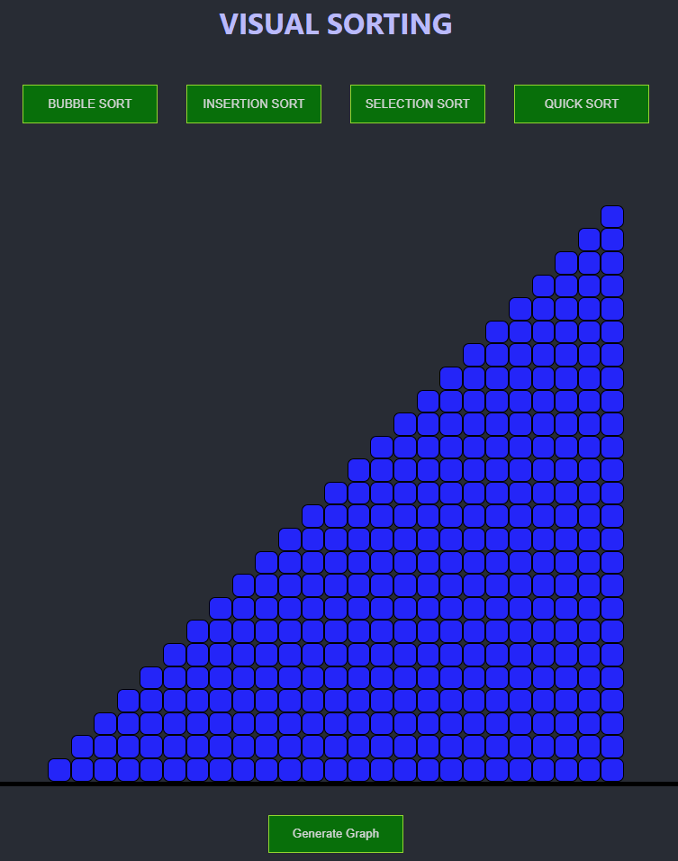

# Visual Sorting

Simple app created using ReactJS that displays how different sorting algorithms sort data in their own unique ways. Currently displays 4 types of sorting algoritms: Bubble, Insertion, Selection, and Quick. Libraries include Redux for state management.

## Screenshots

